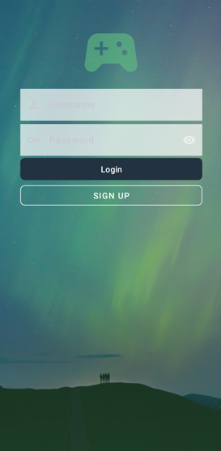
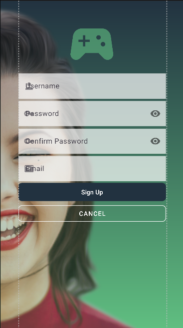
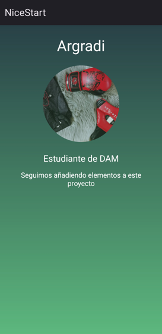

# Este es el primer proyecto en el que estoy trabajando

## Las siguientes, son las dos pantallas del proyecto:

En la primera encontramos dos campos editables(usuario y contraseña) y dos botones(login y signup).
Este ultimo boton, al pulsarlo dirigira a la segunda pantalla y al pulsar en login nos dirigira a una pantalla de usuario.

En esta segunda pantalla encontramos cuatro campos editables(usuario, contraseña, confirmar contraseña y email) y dos botones(signup y cancel).
Al pulsar en cancel nos dirigira a la pantalla anterior y si pulsamos en sign up nos llevara a la pantalla de usuario mencionada anteriormente.

Esta es la pantalla de usuario a la que nos dirigiran los botones anteriores

