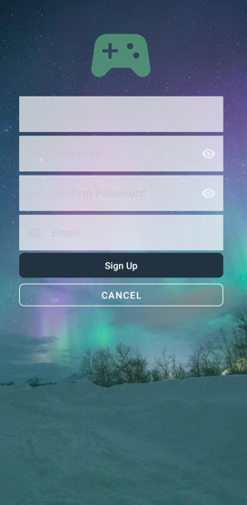

# Este es el primer proyecto en el que estoy trabajando

:construction :Proyecto en cronstruccion :contruction

## Las siguientes, son las dos pantallas del proyecto:

La primera pantalla que veremos es esta, incluyen el logo de la aplicacion, con una animacion que simula que salta mientras gira,
y el titulo, con una animacion que le hace aparecer en la pantalla. Esta pantalla tiene una duracion de 5 segundos para que se 
pueda apreciar la animacion de los componentes claramente.

En la suiguiente encontramos dos campos editables(usuario y contraseña) y dos botones(login y signup).

Si pulsamos login nos llevara a una pantalla en la que aparece una imagen de una persona que no existe y
tenemos la opcion de refrescar la pantalla para que nos muestre otra imagen.

Si mantenemos pulsado nos saldra un pequeño menu que dice "copy" y "download", en los cuales ,si pulsamos,
nos aparecera un toast con la opcion elegida.

En esta pantalla tambien hay dos botones en la esquina superior derecha, aunque no se pueden apreciar muy bien.

Si pulsamos el primero de ellos saldra un toast que dira "Infecting".

El segundo boton abre otro pequeño menu con tres ociones.

Si pulsamos las dos primeras opciones tambien saldra "Infecting".

Pero si pulsamos la tercera opcion nos llevara a la pantalla del perfil del usuario.

Si en la primera pantalla pulsamos Sign Up nos dirigira a la pantalla de Sign Up.
En esta pantalla encontramos cuatro campos editables(usuario, contraseña, confirmar contraseña y email)
y dos botones(signup y cancel). Al pulsar en cancel nos dirigira a la pantalla anterior y si pulsamos en sign up
nos llevara a la pantalla de usuario mencionada anteriormente.

Esta es la pantalla de usuario a la que nos dirigiran los botones anteriores

